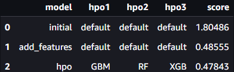
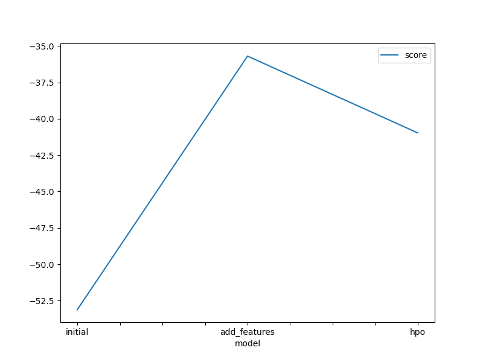
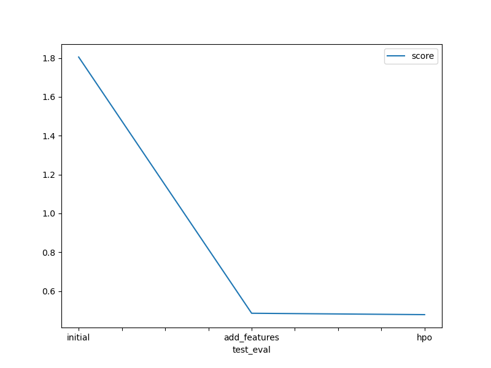

# Report: Predict Bike Sharing Demand with AutoGluon Solution
#### Ooi Shu Hui

## Initial Training
### What did you realize when you tried to submit your predictions? What changes were needed to the output of the predictor to submit your results?
First, there should be no negative values in the predictions or else the submission is prohibited and only when the negative values were replaced that the submission is successful.
Submitting the model that is just training on the raw dataset without performing any data analysis and feature engineering, has shown to achieve a bad score and more improvements could be done.

### What was the top ranked model that performed?
The top ranked model was WeightedEnsemble_L3 with a RMSE score of 40.964641, it has the best Kaggle score of 0.47843. The model was trained on data that had been improved on using exploratory data analysis (EDA) and feature engineering. The model also uses hyperparameters such as Gradient Boosting Machine (GBM), Random Forest (RF) and XGBoost (XGB). 

## Exploratory data analysis and feature creation
### What did the exploratory analysis find and how did you add additional features?
The datetime column was parsed as datetime and seaons and weather were initially labeled as integer.
The values in datetime column were divided into year, month, day and hour with each being individual features and the datetime column was dropped. The features season and weather consists of categorical data so their data types were changed to category instead.

### How much better did your model preform after adding additional features and why do you think that is?
The model has performed significantly better with the score improving from 1.80486 to 0.48555. This could be due to the model being provided with more information as the datetime column is now split into each unique categories, the model can better assess the correlation and the patterns more effectively.

## Hyper parameter tuning
### How much better did your model preform after trying different hyper parameters?
The hyperparameter tuning was useful in improving the model's performance a bit more. Compared with the previous model that was trained on a improved dataset with added features but with defualt hyperparamaters, the model with hyperparameters tuning was able to improve the ascore from 0.48555 to 0.47843. 

### If you were given more time with this dataset, where do you think you would spend more time?
I would have given more time in analysing the data to find more features to add or drop any features that do not help to improve the model. I would also like to do more research on the hyperparameters and further enhance the model to get a better score. 

### Create a table with the models you ran, the hyperparameters modified, and the kaggle score.

### Create a line plot showing the top model score for the three (or more) training runs during the project.

### Create a line plot showing the top kaggle score for the three (or more) prediction submissions during the project.

## Summary
In this project, I was able to apply all the skills and knowledge that I have learned from this first course to develop a machine learning regression model using Autogluon to predict the bike sharing demand. I was able to use EDA, feature engineering and hyperparameters tuning to further enhance the models I developed and achieve a better score. 
